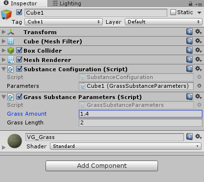

# Substance Configuration

Ability to easily model Substance parameters in the Inspector and
manipulate values at runtime without lots of manual configuration.

# Create config
```csharp 
public class GrassSubstanceParameters : SubstanceParameters
{
    [InputParameter("Grass_Amount")]
    public float GrassAmount;

    [InputParameter("GrassLength")]
    public float GrassLength;
}
``` 

# Connect



# Manipulate
See [example](https://github.com/jbw/SubstanceConfiguration/blob/master/SubstanceConfiguration/Assets/RuntimeManipulationExample.cs)
