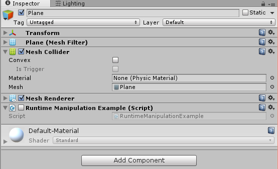

# substance-abuse

Ability to simply configure a model parameters from a Substance texture and manipulate their values at runtime. Defaults can also be set in the Inspector.

# Create config

```InputParameter``` value should map to the exposed Substance parameter name. If you can't find it, hover over the parameter of your Procedural Material component in Unity's Inspector window. 

```csharp 
public class GrassSubstanceParameters : SubstanceParameters
{
    [InputParameter("Grass_Amount")]
    public float GrassAmount;

    [InputParameter("GrassLength")]
    public float GrassLength;
}
``` 

# Connect
Connect the parameter class to the configuration. 


# Manipulate
Use your components and maniplate their parameters. 
```csharp
using UnityEngine;
using System.Collections;

public class RuntimeManipulationExample : MonoBehaviour {

	// Use this for initialization
	void Start () {

        var aCube = GameObject.FindGameObjectWithTag("Cube1");

        var grassParams = aCube.GetComponent<GrassSubstanceParameters>();
        grassParams.GrassAmount = 10;

        var config = aCube.GetComponent<SubstanceConfiguration>();
        config.parameters = grassParams;
        
        // Rebuild the texture
        config.Config();
    }

    // Update is called once per frame
    void Update () {
	
	}
}
```

See [example](https://github.com/jbw/SubstanceConfiguration/blob/master/SubstanceConfiguration/Assets/RuntimeManipulationExample.cs) of how to change Substance property values for a configuration. 




# Known Compatibility 
* Substance >=3.5 
* Unity >= 5

http://docs.unity3d.com/ScriptReference/ProceduralMaterial.html
